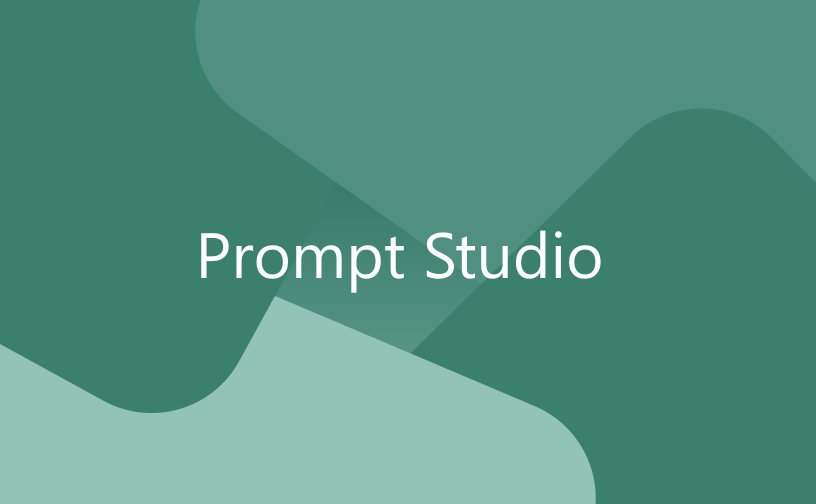

中文 | [English](./README.md)

## 描述

PromptStudio 是一款面向 Windows 桌面的应用程序，旨在与 OpenAI 的 API 无缝交互。

这款应用程序是测试提示和与 GPT 模型进行对话交流的必备工具，包括类似聊天的互动。

它专为开发人员、研究人员和热衷于探索人工智能语言模型能力的爱好者量身定制。

## 功能

- **提示测试：** 使用 OpenAI 的 API 轻松测试各种提示，使用户能够尝试不同的输入并观察 AI 的反应。
- **GPT 聊天界面：** 与 GPT 模型进行类似聊天的对话，提供一个用户友好的界面，以自然直观的方式进行交互。
- **用户友好设计：** 一个清晰直观的用户界面，使所有级别的用户都能轻松导航和使用。
- **可定制设置：** 调整设置以控制应用程序的行为，如响应长度、模型选择和其他参数。

## 安装

1. 从 [Releases 页面](https://github.com/lightsing/PromptStudio/releases) 下载最新版本。
2. 按照屏幕上的指示安装应用程序。

## 使用

开始使用 PromptStudio：

1. 启动应用程序。
2. 在设置中输入您的 OpenAI API 密钥（首次使用时需要）。
3. 开始输入提示或与 GPT 模型进行对话。
4. 根据需要调整设置以定制您的互动。

## 故障排除

### 显示似乎出现故障或无法正常工作。

此应用程序使用 Fluent UI 图标，对于 Windows 11 之前的 Windows，
您可能需要安装 [Segoe Fluent Icons](https://aka.ms/SegoeFluentIcons) 字体。

由于许可限制，我们无法将此字体与应用程序捆绑在一起。

## 贡献

欢迎贡献！请阅读 [CONTRIBUTING.md](./CONTRIBUTING.md) 了解更多信息。

## 许可证

本项目根据 [AGPL-3.0 许可证](./LICENSE) 授权。
